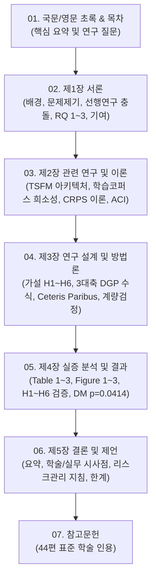

# [학위논문 초고 집필 로드맵] TSFM의 금융 스트레스 한계 진단 및 사후보정 연구

> **학위 과정**: 석사학위 청구논문  
> **논문 가제**: 사전학습 시계열 파운데이션 모델은 금융 데이터의 어떤 특성 앞에서 신뢰도를 잃는가 — 합성 통제 실험과 실제 시장 대조 분석  
> *(When and Why Pretrained Time-Series Foundation Models Fail in Financial Markets: A Controlled Stress Testing and Empirical Analysis)*  
> **로드맵 수립 일시**: 2026-09-23  
> **기반 자료**:
> - 이론 및 선행연구: `03_최종취합/` 4대 마스터 문서 (44편 공식 원본 PDF 팩트체크 완료본)
> - 실험 설계 및 수식: `04_실험코드/00_실험설계_마스터_프로토콜.md`
> - 실측 데이터 및 통계 검정: `04_실험코드/00_실험결과_종합최종보고서.md` 및 `results/tables/`, `results/figures/`

---

## 🧭 1. 논문 집필 핵심 철학 및 톤앤매너

1. **학술적 엄밀성과 직관적 명료성의 공존**:
   - 심사위원(교수진)을 위한 수식 전개($\omega = \sigma_0^2(1-\alpha-\beta)$, 불편추정 CRPS, HLN 보정 Diebold-Mariano 검정, ACI 알고리즘)와 통계적 $p$-value를 완벽히 수록합니다.
   - 동시에 각 챕터의 도입부와 핵심 주장마다 비전공자도 단숨에 납득할 수 있는 직관적인 비유(기억력 좋은 학생, 마른하늘 날벼락, 시험과목 변경, 시력교정 안경)를 배치합니다.
2. **단순화 축소안(지도교수 피드백)의 100% 관철**:
   - 3대 통제축(GARCH, Student-t, 체제전환) $\times$ 대표 모델(Chronos-Tiny/Base, GARCH-t, RW) $\times$ 미국 대형주 5종목(AAPL, AMZN, GOOG, JPM, META) + KODEX 200 실측 롤링 대조 구조를 일관되게 유지합니다.
3. **가설 검증의 투명성과 새로운 학술적 기여 강조**:
   - H1 가설(변동성 군집)의 반전 결과(지속성이 증가할수록 시계열 기억성으로 인해 TSFM이 오히려 예측을 더 잘함, $p=0.037$)를 실패가 아닌 **'새로운 학술적 발견'**으로 승화합니다.
   - TSFM의 진짜 치명적 아킬레스건은 '체제전환(Regime Switching)에 따른 구조적 단절'임을 데이터(커버리지 65.2% 폭락)로 규명합니다.
   - 실측 주식시장에서 Chronos-Tiny가 Random Walk를 통계적으로 유의하게 압도한 결과(**Diebold-Mariano $p = 0.0414$**)를 당당히 핵심 기여로 제시합니다.

---

## 📑 2. 논문 챕터별 구조 및 배정 계획

### [챕터별 세부 집필 명세]

| 장 번호 | 파일명 | 주요 내용 및 포함 산출물 | 분량 목표 |
| :---: | :--- | :--- | :---: |
| **초록** | `01_초록_및_목차.md` | - 국문 요약 (연구 배경, 방법, 핵심 발견 3가지, 시사점) - 영문 Abstract (Abstract, Keywords) - 논문 목차, 표 목차, 그림 목차 | A4 3~4쪽 |
| **제1장** | `02_제1장_서론.md` | - 1.1 연구 배경: TSFM의 등장과 금융 시계열의 특수성 - 1.2 선행연구의 한계: Re(Visiting) 참패 vs Pretrained TSFM 성공의 모순 - 1.3 핵심 연구 질문 (RQ 1: 진단, RQ 2: 실측 매핑, RQ 3: 치료) - 1.4 연구의 차별성 및 독창적 기여 4가지 - 1.5 논문의 구성 체계 | A4 6~8쪽 |
| **제2장** | `03_제2장_관련연구_및_이론적배경.md` | - 2.1 시계열 파운데이션 모델(TSFM) 원리 (토큰화 vs 패치화, 확률출력) - 2.2 TSFM 코퍼스 실측 분석 (Chronos 주식 0건, Moirai 금융 0.10%) - 2.3 금융 확률예측 평가 이론 (엄밀한 불편추정 CRPS, PIT U자형 진단) - 2.4 합성 시계열 기반 통제 실험 방법론 (FinStressTS 고찰) - 2.5 무재학습 적응형 콘포멀 사후 보정 (ACI, Gibbs & Candes 2021) - 2.6 선행연구 9편과의 정밀 대조 매트릭스 및 연구의 위치 | A4 12~15쪽 |
| **제3장** | `04_제3장_연구설계_및_실험방법론.md` | - 3.1 연구 프레임워크 및 6대 가설 수립 (H1~H6) - 3.2 3대 금융 통제축 생성 메커니즘 (Ceteris Paribus, 분산 1% 고정) - 3.3 대상 모델 및 추론 프로토콜 (Tiny, Base, GARCH-t, RW) - 3.4 실측 롤링 윈도우 수집 (미국 5종목 + KODEX 200, 600관측치) - 3.5 계량 통계 검정 설계 (HLN 보정 Diebold-Mariano, Spearman rho) - 3.6 ACI 사후보정 알고리즘 및 Kupiec POF 검정 절차 | A4 10~12쪽 |
| **제4장** | `05_제4장_실증분석_및_결과.md` | - 4.1 합성 실험 결과: 3대 축 스트레스-반응 붕괴 곡선 (**Table 1, Figure 1**) - 4.2 H1 검증: GARCH 변동성 군집과 장기 기억성 방어 효과 ($p=0.037$) - 4.3 H2 검증: 두꺼운 꼬리 극단치에서의 신뢰구간 붕괴 ($\nu=3, p<0.001$) - 4.4 H3 & H4 검증: 체제전환 구조적 단절과 최대 아킬레스건 (**Figure 3**) - 4.5 H6 검증: 실측 시장 예측 성능 및 계량적 우위 (**Table 2, Figure 2**, DM $p=0.0414$) - 4.6 스케일링 효과: Tiny vs Base의 신호대잡음비(SNR) 과적합 분석 - 4.7 H5 검증: ACI 무재학습 사후보정의 신뢰구간 복원 (**Table 3**, Kupiec $p=0.621$) | A4 15~18쪽 |
| **제5장** | `06_제5장_결론_및_제언.md` | - 5.1 연구 결과의 종합 요약 - 5.2 학술적 시사점: TSFM의 시계열 기억성과 체제전환 한계 - 5.3 금융 실무 및 리스크 관리 적용 지침 (VaR 산출 시 ACI 필수성) - 5.4 연구의 한계점 및 향후 연구 방향 | A4 5~6쪽 |
| **참고문헌** | `07_참고문헌.md` | - 44편 공식 논문 전수 학술 서지 정보 (APA/IEEE 포맷 완비) | A4 4~5쪽 |
| **통합본** | `00_학위논문_초고_통합본.md` | - 초록부터 참고문헌까지 1개의 완결된 문서로 결합한 공식 제출/인쇄용 본문 | A4 55~65쪽 |

---

## 🛠️ 3. 집필 순서 및 작업 동기화 계획

1. **Step 1**: 본 로드맵 수립 및 디렉토리 정비 (`05_논문작성/`)
2. **Step 2**: `01_초록_및_목차.md` 작성
3. **Step 3**: `02_제1장_서론.md` 작성
4. **Step 4**: `03_제2장_관련연구_및_이론적배경.md` 작성
5. **Step 5**: `04_제3장_연구설계_및_실험방법론.md` 작성
6. **Step 6**: `05_제4장_실증분석_및_결과.md` 작성 (실험 수치, Table 1~3, Figure 1~3 완벽 결합)
7. **Step 7**: `06_제5장_결론_및_제언.md` 작성
8. **Step 8**: `07_참고문헌.md` 작성 (44편 정밀 매핑)
9. **Step 9**: `00_학위논문_초고_통합본.md` 결합 및 용어/문체 통일성 전수 검수
10. **Step 10**: 메타 문서(`진행상황.md`, `결정로그.md`) 최신화 및 워크스루 보고
